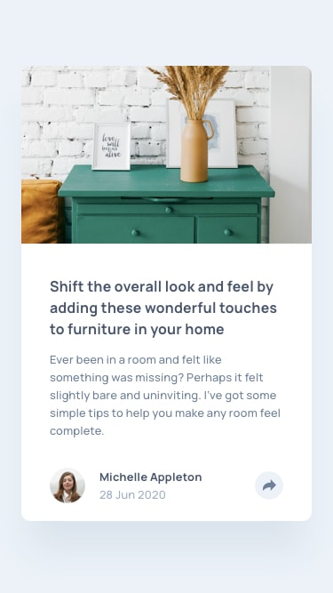

# Frontend Mentor - Article preview component solution

This is a solution to the [Article preview component challenge on Frontend Mentor](https://www.frontendmentor.io/challenges/article-preview-component-dYBN_pYFT). Frontend Mentor challenges help improve my coding skills by building realistic projects.

## Table of contents

- [Overview](#overview)
  - [The challenge](#the-challenge)
  - [Screenshot](#screenshot)
  - [Links](#links)
- [My process](#my-process)
  - [Built with](#built-with)
  - [What I learned](#what-i-learned)
  - [Continued development](#continued-development)
  - [Useful resources](#useful-resources)
- [Author](#author)
- [Acknowledgments](#acknowledgments)

## Overview

This project involves writing HTML and TailwindCSS code, uploading it to Git, providing a live view, and maintaining code format and style.

### Screenshot

<p align="center">
  
</p>

<p align="center">
  
</p>

### Links

- Solution URL: [ solution URL here](https://github.com/mdnaimur/article-preview-component-master)
- Live Site URL: [ live site URL here](https://mdnaimur.github.io/article-preview-component-master/)

## My process

### Built with

- Semantic HTML5 markup
- CSS custom properties
- Flexbox
- CSS Grid
- TailwindCSS
- Mobile-first workflow

### What I learned

Use this section to recap over some of your major learnings while working through this project. Writing these out and providing code samples of areas you want to highlight is a great way to reinforce your own knowledge.

To see how you can add code snippets, see below:

```html
<h1>Some HTML code I'm proud of</h1>
```

```css
.proud-of-this-css {
  color: papayawhip;
}
```

```js
const proudOfThisFunc = () => {
  console.log("🎉");
};
```

## Author

- Website - [Md Naimur Rahman](https://mnr100.vercel.app/)
- Frontend Mentor - [@mdnaimur](https://frontendmentor.io/profile/mdnaimur)
- Twitter - [@md_naimur100](https://twitter.com/md_naimur100)

  **Have fun building!** 🚀
